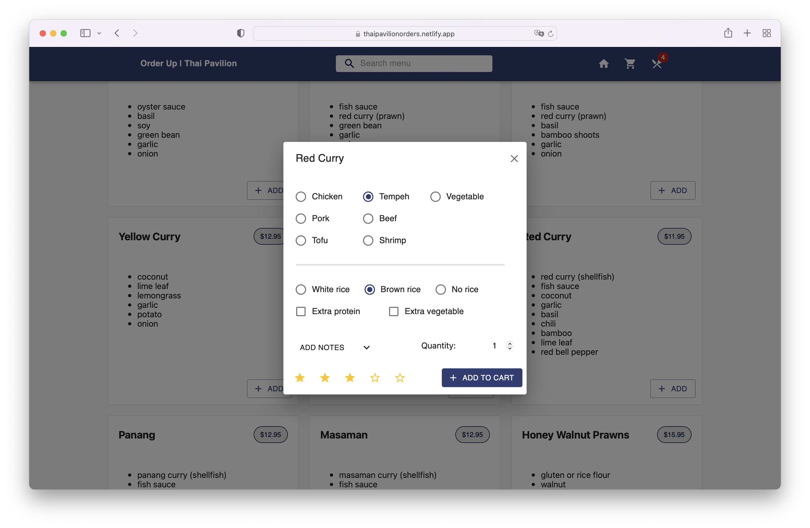
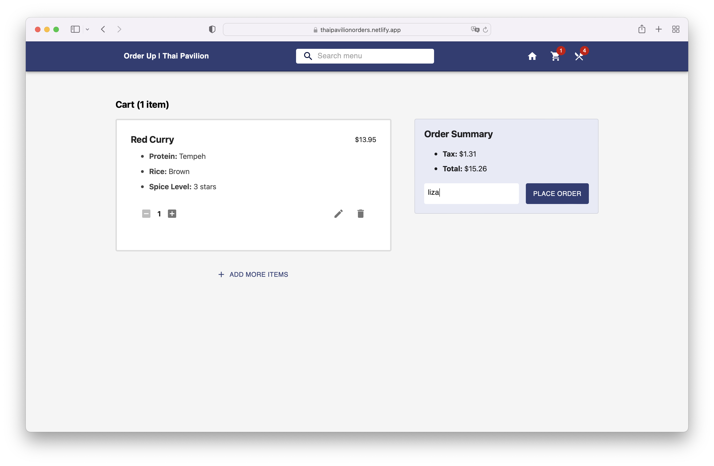
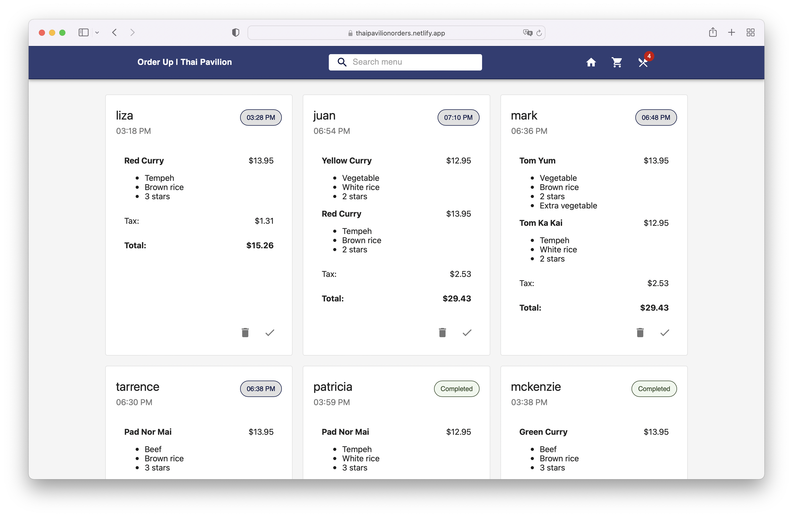

# Order-Up

[Order-Up](https://thaipavilionorders.netlify.app/) is a responsive web app that allows employees to customize, total, and submit orders. A capacity planning algorithm predicts both order completion time based on ongoing orders, and start time for orders submitted in advance. React, Next.js, Firebase, Formik, Material-UI, Yup validation, Jest.

## Homepage
### Browse and search menu items by name 

## Modal
### Customize order options, select quantity, and add notes in the dialogue form 

## Cart
### Finalize or edit customer order 

## Orders Summary
### Watch orders and scheduling appear in realtime from the kitchen! 

